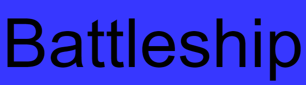
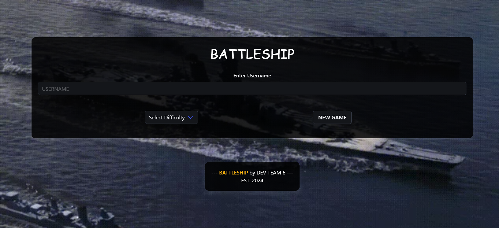
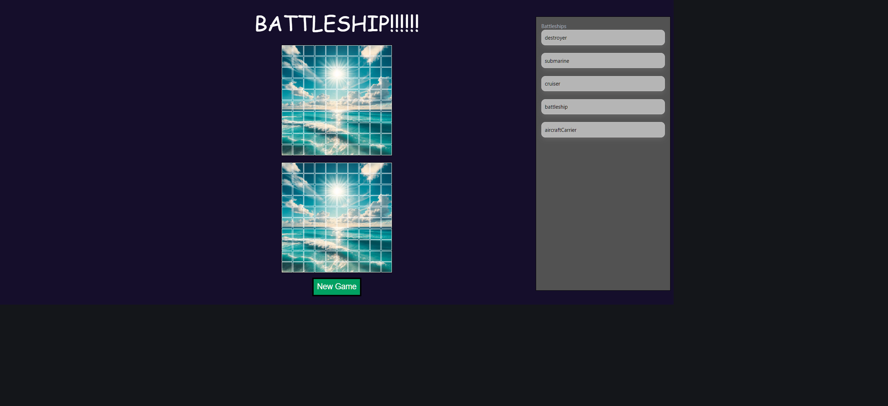
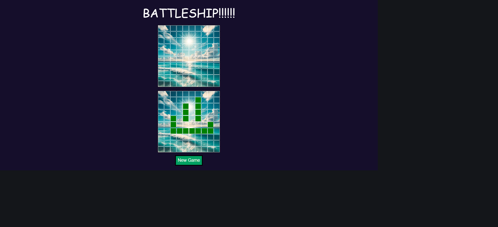
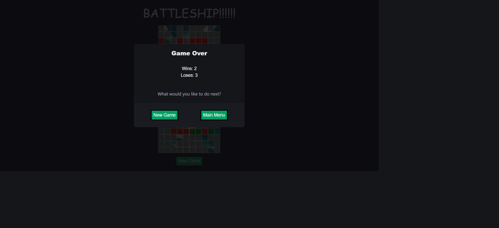

# 

 

---

### Dev Team Six is happy to announce the launch of our rendition of the classic board game Battleship.  Want to sink some ships? Need to kill some time? Want to out wit your opponent?  Please follow the link below to satisfy your Naval fleet commander dreams.  Enjoy! 

## How to use

<strong>Click link to launch website in browser.</strong>

<strong>[Battleship](https://massogon.github.io/goat-battleship/)</strong>

 Upon opening game you are met with the main menu.  This main menu shows a rotating set of GIFs playing in background, title, username input field, drop down window for difficulty, start game button, and footer.  The GIFs running in the background are pulled from Tenor API.  If API/GIFs fail to load it will degrade to a static background image.  Please use the username input field to input a username.  Use the drop down window to select a difficulty.  Once those two conditions are met click start game button.  Failing to satisfy those two fields will cause a confirm window to populate informing you that there is missing information.  The username and difficulty are locally stored to be used while playing game.  

After selecting start game it will open the game board.  This will have your user name saved and will run the corresponding difficulty based on your selection. This page will display the title, the upper grid is the opponent/player attack grid, the lower grid is the player grid, available player ship window, and new game button.  The webpage will ask you to allow your current location.  Doing so will use the weather api to gather your current time of day and display a background image on the grids based on morning, afternoon, and night.  Failing to select allow will degrade the grid color to a light blue to mimic the ocean color.  On the right of screen will be a window that shows your available ships you can place.  Click on your desired ship and mouse-over player grid to preview ship placement options.  If the desired ship placement is available it will show all the cells as gray and if the ship placement is not available the cells will turn red.  You can also press the R key to rotate ship vertically.  Pressing R again will rotate ship back horizontally. 

 Once all player ships have been placed the ship container window on right of screen will disappear and game will start.  Player will be allowed to attack first.  Use the upper grid to make a selection for your attack.  If your attack misses an opponent ship the cell will turn gray.  If your attack hits an opponent ship the cell will turn red.  Once you select your desired cell to attack on the upper grid the opponent will attack the player grid.  If the opponent attack misses the hit cell will turn gray and if hit the cell will turn red.  Continue attacking your desired cells until game is either won or lost.  If you need to reset game board press the new game button on the bottom of screen.  Pressing the new game button will remove all hits/misses and ships from grid.  The available player ship window will also appear to allow you to place ships again. 

 Once game is either won or lost the scoreboard (modal) will display stating game over, your wins and losses based on difficulty and username, new game button, and main menu button.  Pressing new game button keeps your username and difficulty and will remove all hits/misses and ships from grid.  The available player ship window will also appear to allow you to place ships again.  Pressing main menu button will return you to main menu page.  If you would like to change difficulty after game please press main menu button while modal is active.  

 <strong> Game states should render as such: </strong>

## Technologies used 

* Banner maker 
* README tags 
* Bulma CSS framework
* Tenor API
* Weather app API
* Live Server
* Live Share

## Spot an issue?

### We would love to hear from you, heres how:

 Please follow link: 

[GitHub](https://github.com/Massogon/goat-battleship)

 Please create an issue related to any faults or concerns with Battleship. 

## Sources

* banner-maker/banner-marker GitHub repo for README.md banner: [banner-maker](https://github.com/banner-maker/banner-maker.git)
* Shields.io for README.md tags: [shields.io](https://shields.io/)
* Bulma CSS Framework: [Bulma](https://bulma.io/)
* Tenor API: [Tenor](https://tenor.com/gifapi/documentation)
* Weather API: [Weather](https://www.weatherapi.com/)

## Contributors

### Dev Team Six

* <strong>Eduardo [GitHub](https://github.com/Massogon)</strong>
* <strong>Mason [GitHub](https://github.com/MrCows)</strong>
* <strong>Kyle [GitHub](https://github.com/KyleSunday)</strong>
* <strong>Chris [GitHub](https://github.com/xChrisxWilliamsx)</strong>